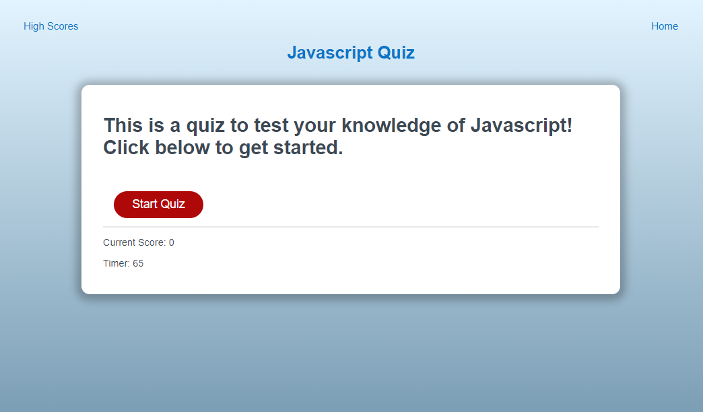

# JSQuiz
  
   

  ## Table of Contents
  --------------------
  - [Description](#description)
  - [Installations](#installation)
  - [Usage](#usage)
  - [License](#licenses)
  - [Contributing](#contribution)
  - [Tests](#testing)
  - [Questions](#contact)

  ## Description
  --------------
  This project is a javascript quiz about javascript!

  ## Installation
  ---------------
  No installation necessary, just visit https://eymerin.github.io/JSQuiz/ to start the quiz.

  ## Usage
  --------
  Just click Start Quiz to get started!

  

  ## Contribution
  ---------------
  No contributions to specify.

  ## Testing
  ----------
  No testing available.

  ## Licenses
  -----------
   Application License: MIT

  https://opensource.org/licenses/MIT

  ## Contact
  -----------
  Please email me with any questions!
  
  GitHub: [eymerin](https://github.com/eymerin)

  Email: [Gmail](mailto:garrett.bryce.young@gmail.com)

